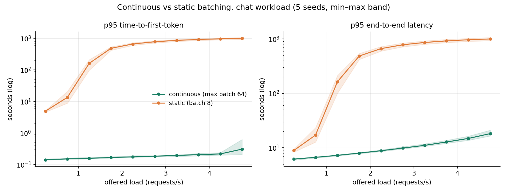
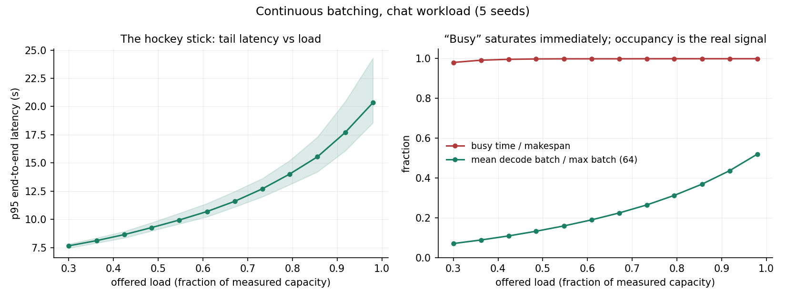
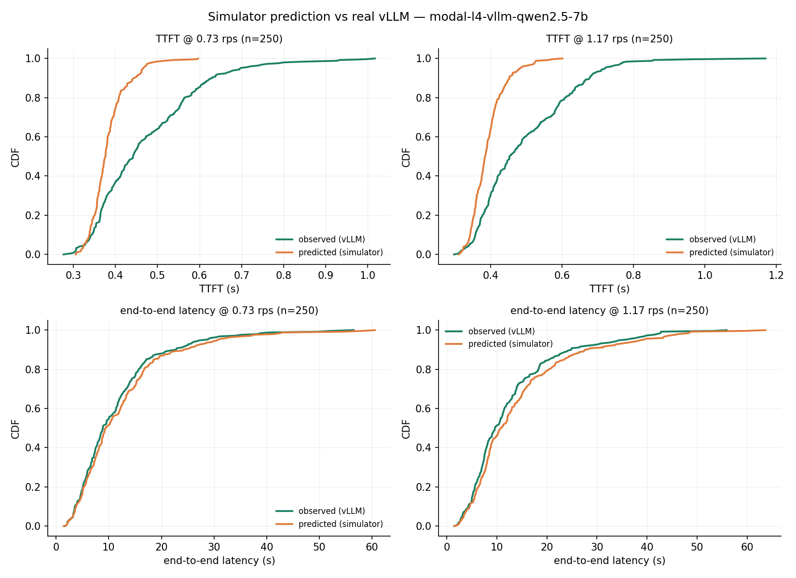

# llm-inference-queueing

Discrete-event simulator for LLM inference serving: how batching policy, arrival process, context length, and prefill/decode scheduling shape tail latency and utilization.

**Research question:** When does batching improve throughput while hurting tail latency?

**Status:** core complete. Simulator validated against real vLLM on an NVIDIA L4: e2e latency predicted within 13% after error attribution (see Validation).

**Paper:** [Queueing the Transformer (PDF)](paper/queueing-the-transformer.pdf) · blog draft in [`paper/blog-post.md`](paper/blog-post.md)

## Quickstart

```bash
uv sync
uv run pytest                                  # 10 tests
uv run python experiments/run_experiments.py   # 350 sims -> results/summary.csv (~1 min)
uv run python analysis/make_plots.py           # -> analysis/plots/*.png
```

Live capture against any OpenAI-compatible endpoint (e.g. local Ollama):

```bash
uv run python live/capture_traces.py --base-url http://localhost:11434/v1 --model qwen2.5:3b --out results/live-m3pro-qwen3b
uv run python live/fit_coefficients.py results/live-m3pro-qwen3b --label m3pro-ollama-qwen2.5-3b
```

## Model

Each engine iteration is either a **prefill** (cost = base + per-token × prompt tokens) or a **decode step** (one token for every active sequence; cost = base + per-seq × batch). Two schedulers:

- **Continuous (iteration-level) batching** — Orca/vLLM-style: new requests join between decode steps, prefill prioritized.
- **Static (request-level) batching** — batch of N prefills together, decodes until the *longest* request finishes; finished sequences pad the batch.

Workload profiles (`chat`, `rag`, `agent`) are lognormal token-length distributions with Poisson or bursty (on/off) arrivals. All runs emit the [shared trace schema](../trace-schema.md).

## Findings so far (simulated, placeholder A10-ish cost coefficients)

1. **Continuous batching carries ~5× the load of static batch-8** on the chat workload (measured saturation: 5.10 vs 1.05 rps). Static's p95 TTFT passes 100s at loads continuous serves at sub-second TTFT. ([plot](analysis/plots/01_load_sweep.png))
2. **Bigger static batches don't fix it:** static batch-32 saturates at 1.70 rps — still below continuous batching capped at batch 8 (2.18 rps). Padding waste dominates. ([plot](analysis/plots/04_frontier.png))
3. **"Busy" is a useless health signal:** busy-time utilization is ≥0.97 at *every* load level from 30% to 98% of capacity — the server is never idle, it just runs underfilled batches. Batch occupancy is the metric that actually tracks load. ([plot](analysis/plots/02_p95_vs_utilization.png))
4. **Burstiness ~doubles p95 TTFT at the same mean rate** (agent workload, on/off arrivals at 4× burst intensity vs Poisson). Mean load is not enough to predict tails. ([plot](analysis/plots/03_burstiness.png))





## Validation against real vLLM (Modal L4, Qwen2.5-7B-Instruct)

Can the simulator *predict* a real serving system? Protocol: fit coefficients from a sequential prompt-length sweep (prefill: 271.6ms + 0.288ms/token, R²=0.887) and a concurrency sweep (decode: 56.9ms + 0.67ms/seq over c∈[1,32], R²=0.702), then replay two held-out Poisson workloads (250 requests each, exact output lengths forced via `ignore_eos`) open-loop against the server, and compare predicted vs observed distributions on identical request sets.

| | p50 TTFT err | p95 TTFT err | p50 e2e err | p95 e2e err |
|---|---|---|---|---|
| raw fitted model @ 0.73 rps | −12% | −7% | +37% | +41% |
| raw fitted model @ 1.17 rps | −10% | −3% | +60% | +51% |
| overhead-attributed @ 0.73 rps | −15% | −33% | **+6%** | **+9%** |
| overhead-attributed @ 1.17 rps | −15% | −33% | **+13%** | **+11%** |

**The error had a diagnosable cause.** The raw model overestimated e2e latency 37–60% because the fitted 272ms prefill intercept — which is mostly per-request overhead (network RTT, API processing, tokenization) — gets charged by the simulator as GPU-blocking time on *every prefill iteration*, stalling all decodes. Real vLLM overlaps chunked prefill with decode. Reattributing 240ms of the intercept to non-blocking per-request overhead (`--request-overhead-s` ablation) collapses e2e error to +6–13% at both load levels ([CDFs](analysis/plots/05_validation_overhead-ablation.png), `results/validation*.json`). The remaining TTFT p95 gap (−33%) is real: observed TTFT has scheduling variance a constant offset can't model.



Run it: `serving/vllm_modal.py` (deploy/stop on Modal), then `capture_traces.py` → `concurrency_sweep.py` → `fit_coefficients.py` → `replay_workload.py` → `analysis/validate.py`. GPU cost for the full protocol: ~$1 on an L4.

## Coefficient fitting also works locally (M3 Pro, Ollama, qwen2.5:3b)

The linear prefill model fits real hardware well: TTFT = 10.2ms + 1.93ms/token, **R² = 0.999** over a 63–2,869-token sweep (40 requests). Implied prefill throughput ~519 tok/s; decode 24.1ms/token (~42 tok/s at batch 1). Fitted profile: `profiles/m3pro-ollama-qwen2.5-3b.json`.

**Gotcha worth keeping:** the first capture run produced garbage repetitions — Ollama's prompt cache skips prefill for identical prompts (flat 0.13s TTFT on repeats vs 5.6s cold at 2.8k tokens). Fixed by putting a unique nonce at the *start* of every prompt, which breaks longest-prefix matching. Cache-aware benchmarking is mandatory.

## Limitations (honest list)

- Simulation experiments use hand-set placeholder coefficients (`CostModel` defaults), not fitted GPU numbers. Magnitudes are illustrative; the *comparisons* (continuous vs static, burstiness) are the claims.
- KV footprint (input + output) is reserved at admission — the scheduler effectively knows output lengths in advance. No preemption/recompute is modeled.
- Prefill-prioritized scheduling only; no chunked-prefill/decode interleaving cost model — this is the main source of e2e overprediction, partially corrected by the overhead ablation rather than properly modeled.
- The 240ms request-overhead split is an ablation estimate, not independently measured (would need server-side metrics or a localhost benchmark to separate network/API/tokenize from GPU time).
- TTFT prediction is a point estimate; observed TTFT variance (scheduling jitter) is unmodeled, so predicted tails are too tight.
- Validation covers one model/GPU/workload (Qwen2.5-7B on L4, chat profile, Poisson) at two load levels below saturation.

## Next

- Model chunked prefill (mixed prefill/decode iterations) instead of the overhead ablation.
- Additional schedulers: shortest-prefill-first, deadline-aware.
- Writeup: "LLM Inference as an Operations Research Problem."
